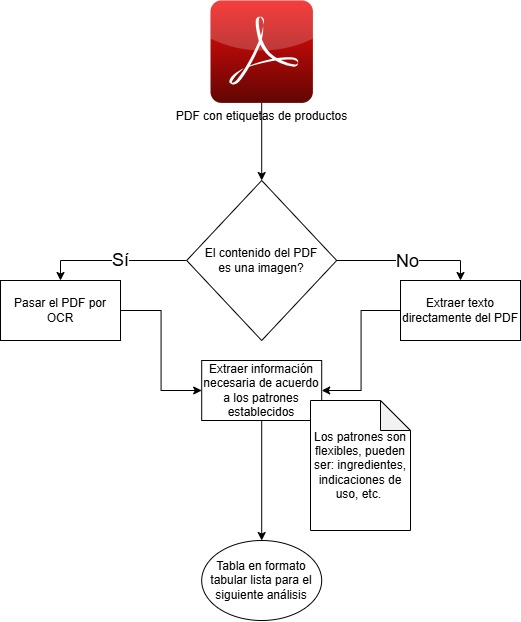

# Demo-tags

Script de Python para extraer patrones de archivos de PDF para comparación contra la normativa vigente. 

## Etapas

El desarrollo de una potencial herramienta puede dividirse en las siguientes etapas:

1. Normalización de los archivos
    
    Tomar todos los archivos en formato PDF y normalizarlos utilizando herramientas de programación, con el fin de obtener un formato tabular para facilitar el análisis posterior. 

2. Análisis
    
    Tomar la normativa actual y hacer un análisis comparativo contra la tabla con los datos de etiquetado para buscar incongruencias.

3. Reporte y potencial visualización
    
    Crear un reporte con los productos cuyo etiquetado no son congruentes con la legislación. 

A continuación se presenta un diagrama de flujo que pretende explicar el proceso de la primera etapa de normalización de los archivos. 

### Figura 1. Proceso de captura de la información de los archivos PDF

